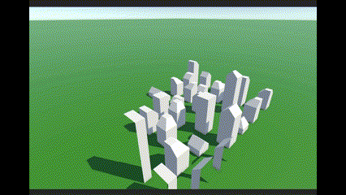
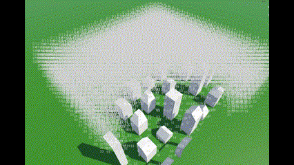

# WaveFunctionCollapse 

---

这是一个使用波函数坍塌算法的Unity示例，使用权重计算熵算法。

 

# 如何开始

1. （可选） 执行配置生成器 `Assets/ProtoPreprocess` ，该脚本根据`Assets/3DWaveFunctionCollapseSample/PrototypeConfig.json`中的插槽配置生成正确的邻居关系，并存放于该文件中。
2. 打开 `Assets/3DWaveFunctionCollapseSample/SampleScene.unity`场景
3. 修改场景中`WFCLauncher`启动器配置：
    1. `RunTime` 开关运行时实时显示
    2. `Size` 生成场景尺寸
4. 运行
5. （可选）如遇过于规律或不合理的情况，请手动调整 `PrototypeConfig.json`中的权重配置。或者使用同目录下的`PrototypeConfig.json.b`文件覆盖（调整好的权重配置备份文件）

